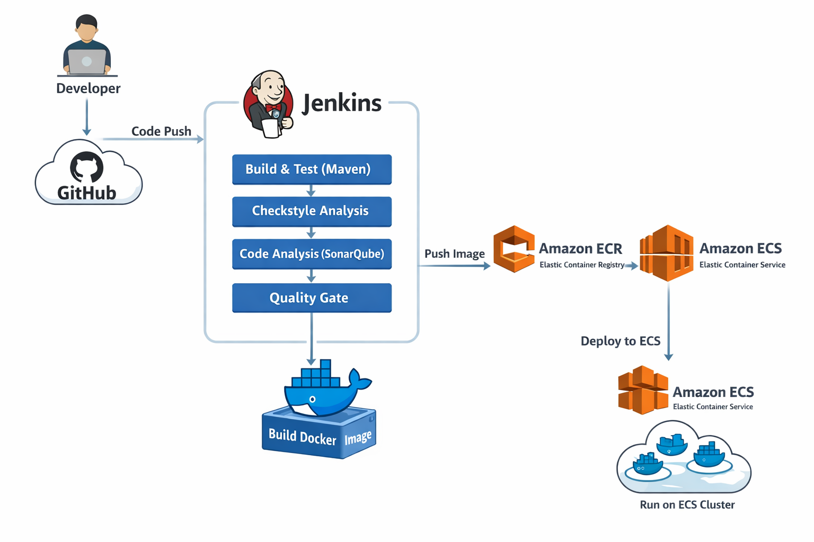

# 🚀 Docker CI/CD Pipeline – Spring Boot on AWS ECS (Fargate)

## 📌 Architecture Overview

```
Developer → GitHub → Jenkins → Maven Build & Test → Checkstyle →
SonarQube Analysis → Quality Gate →
Docker Build → Amazon ECR → Amazon ECS (Fargate)
```

---

## 🧰 Tech Stack

- Source Control: GitHub
- CI Tool: Jenkins
- Build Tool: Maven
- Code Quality: Checkstyle + SonarQube
- Containerization: Docker (Multi-stage build)
- Container Registry: Amazon ECR
- Deployment: Amazon ECS (Fargate)
- Monitoring: CloudWatch + Container Insights
---

## ☁️ AWS Infrastructure Setup

🔹ECS Cluster
- Name: `vprofile`
- Launch Type: **Fargate (Serverless)**
- Container Insights: Enabled
- No EC2 instances managed manually

Fargate handles:
- Provisioning
- Scaling
- Patching
- Infrastructure management
---

### 🔹 Task Definition

Task Name: `vprofileapptask`
Configuration:
- 1 vCPU
- 2 GB RAM
- Container Port: 8080 (Tomcat default)
- Docker Image: Pulled from Amazon ECR
- Logs: Sent to CloudWatch
---

### 🔹 Service Configuration

Service Name: `vprofileappsvc`
- Maintains desired number of running tasks
- Integrated with ALB
- Auto-restarts failed tasks

Load Balancer:
- ALB Name: `vproappelbecs`
- Listener: HTTP (Port 80)
- Target Group: `vproecstg`

Security Group:
- Port 80 open (public access)
- Port 8080 mapped internally
---

## 🔄 CI/CD Pipeline Stages (Jenkins)

1️⃣ Fetch Code

Pulls source from GitHub (docker branch)

2️⃣ Build

mvn install -DskipTests

Artifacts archived.

3️⃣ Unit Testing

mvn test

4️⃣ Checkstyle

Static code style validation.

5️⃣ SonarQube Analysis

Code quality scan and metrics.

6️⃣ Quality Gate

Pipeline stops if quality conditions fail.

7️⃣ Docker Image Build
Multi-stage Docker build:
- Optimized image
- Tagged with BUILD_NUMBER
- Tagged as latest

8️⃣ Push to Amazon ECR
Image uploaded securely using AWS credentials.

9️⃣ Deploy to ECS
aws ecs update-service --cluster vprofile1 --service vprofileappsvc --force-new-deployment

Triggers rolling deployment in ECS.

---

## 🎯 Key DevOps Concepts Implemented

- Fully automated CI/CD pipeline
- Infrastructure as managed service (Fargate)
- Static code analysis enforcement
- Quality Gate enforcement before deployment
- Containerized application deployment
- Rolling updates in ECS
- Cloud-native monitoring

---
## 📈 Result

From code commit to production deployment: 

Fully automated.

No manual intervention.

Scalable and production-ready.


## CI/CD Pipeline Overview

